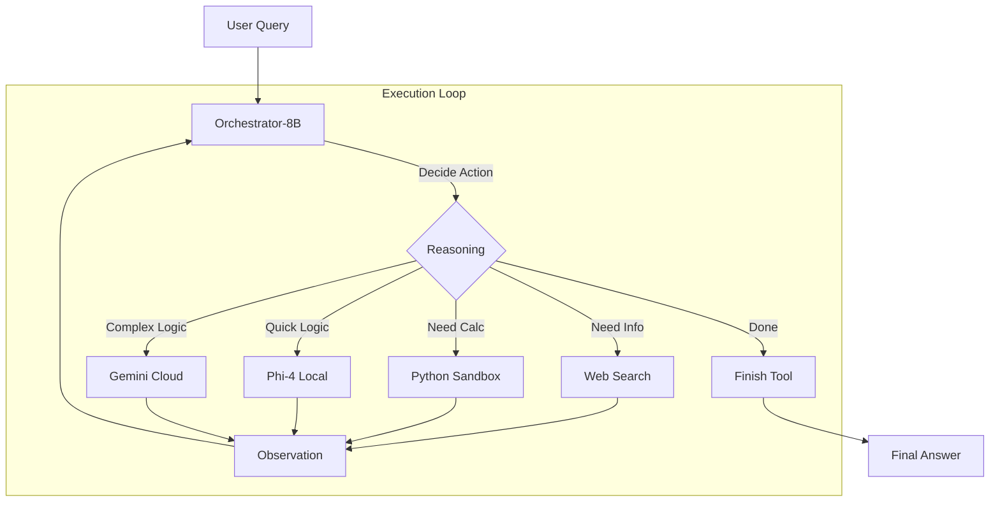

# Architecture Overview

> An intelligent research agent powered by NVIDIA's Orchestrator-8B model.

## key Components

The system has moved away from rigid LangGraph workflows to a flexible, model-driven architecture where **Orchestrator-8B** acts as the central brain.

### 1. The Brain: Orchestrator-8B
- **Model**: `nemotron-orchestrator-8b` (via LM Studio)
- **Role**: Analyzes queries, plans execution, routes to tools, and synthesizes answers.
- **Decision Making**: It decides *everything* — which tool to call, when to search, when to code, and when to finish.

### 2. The Specialists
- **Phi-4 (Local)**: Fast, free local model for quick reasoning, summarization, and simple tasks.
- **Gemini (Cloud)**: Powerful model for complex reasoning and "frontier-grade" intelligence.

### 3. The Execution Loop
The core is a simple, robust loop in `src/orchestrator/loop.py`:
1. **User Query** → System Prompt with Tool Definitions
2. **Orchestrator-8B** → Outputs Structured JSON Action
3. **Tool Execution** → Result fed back as observation
4. **Repeat** until `finish` tool is called or max turns reached.

## High-Level Flow

## Comparisons

| Feature | Old Architecture (LangGraph) | New Architecture (Orchestrator-8B) |
|---------|------------------------------|------------------------------------|
| **Routing** | Hand-coded rules & router chains | **Native model reasoning** |
| **State** | Complex graph state | **Simple conversation history** |
| **Flexibility** | Rigid, predefined paths | **Adaptive, dynamic paths** |
| **Maintenance** | High (graph complexity) | **Low (prompt engineering)** |
